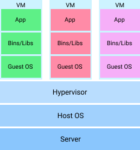
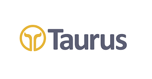

# find incomplete section <>

# 1. ส่วนนำ

## บทคัดย่อภาษาไทย

ปัจจุบันการพัฒนาซอฟต์แวร์และแอปพลิเคชันต่าง ๆ  ได้มีการนำเทคโนโลยีคอนเทนเนอร์เข้ามาใช้งานร่วมกันเนื่องจากความสามารถในการแก้ปัญหาของรูปแบบการพัฒนาแบบเก่าได้จากการที่เทคโนโลยีคอนเทนเนอร์มีความสามารถในการรองรับการทำงานแบบอัตโนมัติและความไม่ซับซ้อนและง่ายต่อการบริหารจัดการทรัพยากรและสภาพแวดล้อม ทำให้หลายองค์กรได้มีการนำเทคโนโลยีคอนเทนเนอร์เข้ามาใช้งานภายใน ผู้จัดทำได้ทำการออกแบบระบบแจ้งเตือนและตรวจสอบที่สามารถใช้งานคุณลักษณะของเทคโนโลยีคอนเทนเนอร์ที่เหมาะสมและเข้ากันกับระบบเดิมที่มีอยู่ เพื่อให้ระบบ infrastructure นั้นมีความเสถียรจากการแจ้งเตือนก่อนที่จะเกิดปัญหานั้นขึ้น สามารถรักษาตัวเองได้และสามารถขยายขนาดเพื่อรองรับงานในอนาคตที่เพิ่มขึ้นได้

## บทคัดย่อภาษาอังกฤษ

ค่อยทำ

## กิตติกรรมประกาศ

ตามที่ข้าพเจ้า นายเสฎฐวุฒิ ทิพย์กรรภิรมย์ได้เข้ามาปฏิบัติงานสหกิจศึกษา ณ บริษัท ออพซ์ตา (ประเทศไทย) จำกัด ระหว่างวันที่ 1 มิถุนายน 2564 ถึง 30 พฤศจิกายน 2563 ทำให้ข้าพเจ้าได้รับความรู้ความเข้าใจและประสบการณ์มากมายก่ายกองที่ไม่สามารถตีมูลค่าออกมาได้ สำหรับรายงานสหกิจศึกษาฉบับนี้สำเร็จได้ด้วยดี จากความช่วยเหลือและความร่วมมือของหลายฝ่ายดังนี้

1. นายศิวกร ตันติวิริยางกูร Project Manager
2. นายพงษ์ศักดิ์ สงวนวงษ์ DevOps Engineer
3. นายอนุรักษ์ จันนาวัน DevOps Engineer

นอกจากนี้ยังมีบุคคลอื่น ๆ อีกที่ไม่ได้อยู่ในรายชื่อข้างต้นที่ได้ให้ความกรุณาแนะนำในการจัดทำรายงานสหกิจศึกษาฉบับนี้ ข้าพเจ้าจึงขอขอบพระคุณทุกท่านที่ได้มีส่วนร่วมในการให้ข้อมูลและให้ความเข้าใจเกี่ยวกับวิธีการปฏิบัติงานรวมถึงการจัดทำรายงานฉบับนี้จนสมบูรณ์

# 2. ส่วนเนื้อหา

## บทที่ 1 บทนำ

### 1.1 ความเป็นมาและความสำคัญ

ปัจจุบันการออกแบบสถาปัตยกรรมซอฟต์แวร์แบบ microservice นั้นเป็นที่นิยมเนื่องจากตอบโจทย์ทาง business และ software ได้เป็นอย่างดีโดยการแยก business logic ออกเป็นส่วนของการทำงานต่าง ๆ ที่เรียกว่า service ประกอบกับเทคโนโลยี container platform เช่น kubernetes ที่เข้ามามีส่วนร่วมสำคัญในการพัฒนาระบบ infrastructure ให้มีความเสถียร, สามารถจัดการกับทรัพยากรได้อย่างมีประสิทธิภาพ, มีความสามารถในการทำ self-healing และสามารถขยายขนาดเพื่อรองรับ workload ขนาดมากได้

การนำระบบ monitoring และ alerting เข้ามา เพื่อตรวจสอบและแจ้งเตือน infrastructure ที่รองรับ container platform เช่น Kubernetes สามารถทำให้วิเคราะห์และเข้าใจถึงการใช้ทรัพยากรถึงระดับ containers หรือ pods เพื่อให้เกิดการใช้งาน resource ได้อย่างคุ้มค่า ตลอดจนตัดสินใจในการ scale application ได้อย่างเหมาะสม นอกจากนี้การมีระบบ alerting ที่ทันสมัยจะช่วยแจ้งเตือนเมื่อระบบมีปัญหา ทำให้สามารถแก้ไขปัญหาได้อย่างรวดเร็วและตรงจุด อีกทั้งการใช้ระบบ monitoring และ alerting ที่ทันสมัยนี้ ยังรองรับการทำ integration กับระบบอื่น ๆ ในอนาคตอีกด้วย

### 1.2 วัตถุประสงค์ของการวิจัย

1. เพื่อศึกษาการใช้งานและติดตั้ง Kubernetes ที่รองรับการลง application แบบ container platform
2. เพื่อปรับปรุง infrastructure ให้มีความสามารถในการซ่อมแซมได้อย่างรวดเร็ว (Mean time to recovery)  และมีความน่าเชื่อถือสูง (high avaliability)
3. เพื่อศึกษาการติดตั้งและการทำงานของระบบ monitoring และ alerting ของระบบ
4. เพื่อศึกษาวิธีการออกแบบ Alerting ให้เหมาะสมกับระดับตามความสำคัญต่างๆ(Severity) ได้อย่างเหมาะสม 
5. เพื่อปรับปรุงระบบ monitoring และ alerting ให้เข้ากับ infrastructure ที่มีอยู่

### 1.3 ขอบเขตของการวิจัย

1. ตรวจสอบ, วางแผน และออกแบบระบบ Kubernetes เพื่อรองรับ high availability และค่า mean time to recovery ที่ต่ำ
2. ออกแบบระบบเพื่อรองรับการ Monitoring ของ Infrastructure และ Kubernetes
3. ออกแบบระบบเพื่อรองรับการ Monitoring Application ที่ติดตั้งด้วยเทคโนโลยี Container Platform ซึ่งรองรับการติดตั้งใน Kubernetes
4. ออกแบบและติดตั้ง Dashboard ที่รองรับการแสดงผล Metric จากระบบ Monitoring
5. ออกแบบและติดตั้งระบบ Alerting โดยมีการจัดลำดับการแจ้งเตือน (Severity) ที่เหมาะสมรองรับกับ Infrastructure และ Application
6. ตรวจสอบ Alerting ที่ติดตั้ง เพื่อความถูกต้องของระบบแจ้งเตือน

### 1.4 วิธีดำเนินการวิจัย

### 1.5 ประโยชน์ที่คาดว่าจะได้รับ

Infrastructure ที่ได้รับการปรับปรุงให้ทันสมัย พร้อมกับระบบตรวจสอบและแจ้งเตือนปัญหาก่อนที่จะเกิดขึ้น เพื่อให้มีความ high avalability ที่สูงและสามารถรองรับ wokrload ได้เป็นจำนวนมาก
ได้รับระบบ monitoring ที่สามารถใช้งานได้บน kubernetes
สามารถดูสถานะของ application ที่ติดตั้งแบบ container platform ได้พร้อมกับรองรับการขยายเมื่อเพิ่ม application ขึ้นมาในอนาคต
ได้รับ dashboard แสดงถึงค่าสถานะที่สำคัญของระบบ เพื่อใช้ในการวิเคราะห์ข้อมูลการใช้งานเชิงทรัพยากรและการตรวจสอบปัญหาที่เกิดขึ้นภายในระบบ
ระบบ alerting สามารถแจ้งเตือนปัญหาก่อนที่จะเกิดขึ้นได้ โดยสามารถแบ่งตามระดับความรุนแรงของปัญหานั้นในระบบเพื่อให้ระบบสามารถทำงานได้อย่างเสถียรและคนสามารถเตรียมการรับมือแก้ไขกับปัญหาได้ดียิ่งขึ้น
ได้รับระบบ alerting ที่มี false negative น้อยทำให้เมื่อมีการแจ้งเตือนจากระบบ alerting คนจะให้ความสำคัญกับแจ้งเตือนนั้น

## บทที่2 แนวคิด ทฤษฎีและงานวิจัยที่เกี่ยวข้อง

### 2.1 ทฤษฎีที่เกี่ยวข้อง (หลักตามประเด็นให้ครอบคลุมเรื่องที่วิจัย)

- 2.1.1 Container Technology [4]
  - Container
    - What is Virtual Machine (VM) ?
      ```txt
      virtual machine คือเครื่องเสมือนที่ทำหน้าที่เป็น computer เพื่อใช้ในการคำนวณงานต่าง ๆ โดยการใช้เทคโนโลยี 
      virtualization ซึ่งเป็นกระบวนการที่ใช้ในสร้าง virtual computer ด้วย central processing unit (CPU), 
      memory และ disk space ที่ถูกแบ่งมาจากคอมพิวเตอร์ของจริงดังนั้น virtual machine นั้นจึงเปรียบเสมือนกับ 
      virtual computer หรือ software-defined computer ทำให้สามารถแยก environment ของเครื่องออกจากกันได้
      ```
      
    - What is Container ?
      ```txt
      container คือ เทคโนโลยีที่ใช้ในการแยกและจัดการ environment การทำงานของ application ซึ่งมีความ
      คล้ายคลึงกับแนวคิดของ virtual machine เทคโนโลยี container ทำให้การติดตั้ง application นั้นสามารถ
      ทำในสภาพแวดล้อมแบบไหนก็ได้ขอแค่ให้ OS นั้นสามารถติดตั้ง container engine ได้ก็พอ
      ```
      
    - What is the diffent between container and virtual machine ?
      ```txt
      container กับ virtual machine นั้นถูกใช้ใน use case ที่ต่างกันดังนั้นถ้าจะเปรียบเทียบก็จะสมมุติกรณีที่รัน 
      application เดียวกันบนทั้ง 2 เทคโนโลยีนี้
      ```
      - ส่วนของ virtual machine จะมี overhead ของการทำงานของ OS ทำให้กิน memory และ disk เพิ่มขึ้นแต่ใน container นั้นต้องการแค่ binary และ libary ที่เกี่ยวข้องเท่านั้นเพื่อให้ application สามารถทำงานได้
        - การที่จะเคลื่อนย้ายหรือเพิ่มจำนวนของ instance ต่าง ๆ นั้น container สามารถทำได้ดีกว่าเนื่องจากไม่เสีย overhead
      - application บางชนิดไม่ได้ออกแบบมาสำหรับการทำงานแบบ container ก็จะไม่สามารถใช้งานความสามารถของ container ได้สุดความสามารถ 
      - ทั้งสองสามารถทำงานแบบแยก environment ได้ในส่วนของ container จะสามารถแยกได้ในระดับ application ในส่วนของ virtual machine จะแยกได้ในระดับ OS
      - ข้อมูลที่ถูกเก็บจาก container โดยแรกเริ่มจะถูกเก็บไว้ที่ writable container layer ดังนั้นเมื่อ container นั้นหายไปข้อมูลภายในก็จะหายไปด้วย
  - Kubernetes
    - What is Kubernetes ?
      
      ```txt
      Kubernetes คือ เทคโนโลยีที่ใช้ในการบริหารจัดเทคโนโลยีคอนเทนเนอร์หรือก็คือ container orchestration 
      ที่ถูกคิดค้นโดย Google ซึ่งการที่ระบบสามารถทำ orchestration ได้นั้นหมายความว่าระบบนั้นสามารถจัดการทรัพยากร
      ที่มีหรือที่เพิ่มขึ้นมาได้อย่างอัตโนมัติ รวมไปถึงการดูแล application ที่ทำงานอยู่บน container ได้ตลอดเวลา
      สามารถนำไปใช้งานได้ทั้งบน on-premise หรือ public, private หรือ hybrid cloud ได้
      ```
    - คุณสมบัติของ Kubernetes
      1. service discovery and load balancing
        ```txt
        Kubernetes สามารถจัดการการเข้าถึง container ที่อยู่ภายใต้ service เดียวกันได้โดยการทำตัวเป็น load balancer 
        เพื่อกระจาย traffic ออกไปยัง container ที่เกี่ยวข้องได้ ทำให้เราสามารถเพิ่มหรือลบ container ได้ในขณะที่ 
        application สามารถทำงานได้เหมือนเดิม 
        ```
      2. storage orchestration
        ```txt
        Kubernetes สามารถเชื่อมต่อกับ storage system อื่น ๆ ได้ตามที่ต้องการเพื่อให้ข้อมูลนั้นไม่หายไปเมื่อ container 
        นั้นจบการทำงาน
        ```
      3. automated rollouts and rollbacks
        ```txt
        Kubernetes สามารถกำหนดสถานะที่ต้องการให้กับ container ได้และยังสามารถทำการแก้ไขสถานะที่ต้องการได้หากเกิด
        ข้อผิดพลาดจากการที่แก้ไขสถานะ Kubernetes อนุญาตให้สามารถทำการ rollback กลับไปยังสถานะก่อนแก้ไขได้
        ```
      4. automated bin packing
        ```txt
        Kubernetes มีการบริหารจัดการทรัพยากรให้เพียงพอต่อ application ที่จะมาทำงานใน cluster ได้โดยมี algorithm 
        ที่ใช้ในการคำนวณว่า worker node ไหนที่จะสามารถเอา application ไปทำงานบนนั้นได้ ทำให้สามารถใช้ทรัพยากรได้อย่างคุ้มค่าที่สุด
        ```
      5. self healing
        ```txt
        Kubernetes จะทำการเริ่มใหม่ให้กับ container ที่หยุดทำงานลง สร้าง container ใหม่หรือทำลาย container 
        เดิมทิ้งถ้า container นั้นไม่ตอบสนองต่อการทำ health check เมื่อ container นั้นไม่พร้อมใช้งาน kubernetes 
        จะไม่ forward traffic ไปยัง container เหล่านั้นจนกว่าจะกลับมาทำงานได้โดย user ที่เข้ามาใช้งานจะไม่เห็นการทำงานเหล่านี้เลย
        ```
      6. secret and configuration management
        ```txt
        Kubernetes สามารถจัดเก็บข้อมูลที่เป็นความลับได้เช่น username, password, token หรือ SSH key 
        และสามารถทำการแก้ไขค่าเหล่านี้ได้โดยไม่ต้องทำการสร้าง container ใหม่
        ```
    - องค์ประกอบ Kubernetes
      
      
      ```txt
      เมื่อทำการ deploy kubernetes cluster จะได้ kubernetes cluster มาซึ่งประกอบไปด้วยชุดของ worker machines ที่เรียกว่า node ที่ทำหน้าที่จัดการกับ workload ต่าง ๆ ใน cluster
      node ทำหน้าที่ในการ host pod ซึ่งตัว pod ก็คือชุดของ containers โดยแต่ใน 1 cluster ต้องมีอย่างน้อย 1 node เพื่อให้สามารถทำงานได้
      ```
      1. Control Plane Components
        ```txt
        คือ ส่วนที่ทำหน้าที่ในการตัดสินใจหลักของ Kubernetes cluster และตรวจจับและตอบโต้กับเหตุการณ์ต่าง ๆ ที่เกิดขึ้นกับ cluster
        ```
      - kube-api-server
        ```txt
        คือ ส่วนที่ใช้ในการสื่อสารกับ components อื่น ๆ ของ Kubernetes
        ```
      - etcd
        ```txt
        คือ ที่เก็บข้อมูลของ Kubernetes cluster ในรูปแบบ key: value เช่น ข้อมูลของ Pod, service ที่ทำงานบน cluster
        เมื่อมีการแก้ไขหรือเพิ่มข้อมูลเข้าไปใน Kubernetes จะมีการมาเขียนข้อมูลที่ ETCD เสมอ
        ```
      - kube-scheduler
        ```txt
        คือ components ที่ใช้ในการระบุ worker node ปลายทางที่เหมาะสมกับ Pods นั้น ๆ ผ่าน scheduling algorithm
        ```
      - kube-controller-manager
        ```txt
        คือ ส่วนที่ทำหน้าที่ดูแลสภาวะของ Kubernetes cluster ให้อยู่ในสภาวะที่กำหนดไว้
        ```
      2. Node Components
      - kubelet
        ```txt
        คือ ส่วนที่ทำหน้าที่ดูแลทรัพยากรต่าง ๆ ใน worker node และรอรับคำสั่งจาก kube-api-server
        ```
      - kube-proxy
        ```txt
        คือ ส่วนที่ทำหน้าที่เป็น proxy บนทุก ๆ node ใน cluster และทำหน้าที่ดูแล network rule บน node 
        ที่ proxy อยู่ทำให้สามารถเกิดการเชื่อมต่อจากภายในและภายนอกกับ pod ได้ 
        ```
      - container runtime
        ```txt
        คือ software ที่มีหน้าที่ในการดูแล container ที่ทำงานอยู่
        ```
- 2.1.2 Performance Testing
  ```txt
  คือ การจำลองสภาวะต่าง ๆ ของระบบในภาวะที่น่าจะเกิดขึ้นจริงหากมีผู้ใช้งานเข้ามาพร้อมกัน
  ```
  - ชนิดของ Performance Testing
    - Load Testing
      
      
      ```txt
      คือ การทดสอบประสิทธิภาพของระบบทั่วไปว่าเมื่อมีคนใช้งานจำนวนหนึ่งจะมีเวลาตอบกลับเท่าไหร่
      ```
    - Capacity Testing
      
      
      ```txt
      คือ การทดสอบหาความจุสูงสุดที่ระบบสามารถรองรับได้และอยู่ในเวลาตอบกลับที่กำหนด
      ```
    - Stress Testing
      
      
      ```txt
      คือ การทดสอบหาประสิทธิภาพของระบบในสภาวะที่สุดโต่ง เช่น การใช้ระบบที่มีทรัพยากรน้อยที่สุดเพื่อหาพฤติกรรมของระบบ
      ```
    - Soak Testing
      
      
      ```txt
      คือ การทดสอบหาประสิทธิภาพของระบบเมื่อมีการใช้งานอย่างต่อเนื่องเป็นระยะเวลาที่นานขึ้นเพื่อหาปัญหาที่อาจจะพบเมื่อไม่ได้ระบบไม่ได้ทำงานระยะเวลาสั้น ๆ 
      ```
  - Scenario of load testing 
    - Type of host
      - Standalone
      ```txt
      คือ รูปแบบการทำ testing ที่ใช้เพียงเครื่องคอมพิวเตอร์เพียงเคยเดียวเป็นตัวสร้าง traffic ไปยังระบบปลายทาง
      ```
      - Distributed Testing
      ```txt
      คือ รูปแบบการทำ testing ที่ใช้เครื่องคอมพิวเตอร์หลาย ๆ เครื่องในการสร้าง traffic แล้วส่งไปยังระบบปลายทาง
      ```
  - What is Taurus

    
    ```txt
    คือ เป็น open source เครื่องมือที่ใช้สำหรับการทำ load test และ functional test 
    โดยทำตัวเป็นตัวที่ห่อหุ้มเครื่องมือสำหรับการทำ load test และ functional test อีกที 
    ทำให้ผู้ใช้งานสามารถเขียน script ได้ในรูปแบบของ YAML/JSON เพื่อไปเรียกใช้เครื่องมืออื่น ๆ 
    ที่ต่างกันได้และง่ายต่อการเก็บใน source control system

    Taurus สามารถนำไปใช้งานได้กับงานอัตโนมัติเนื่องจากไม่ต้องการ UI เพื่อทำงานและสามารถกำหนด 
    Service-Level Objective (SLO) หรือ Service-Level Agreement (SLA) ได้โดยการกำหนด
    pass/fail criteria ขึ้นมา   
    ```
    ตัวอย่าง script ที่ใช้งาน
    ```yaml
    settings:
      default-executor: jmeter
      env:
        URL:  https://<url>
      artifacts-dir: ./%Y-%m-%d_%H-%M-%S.%f
      verbose: false

    scenarios:
      api_capacity_testing:
        data-sources:
        - path: payload.csv
          delimeter: ','
          quoted: 'false'
          loop: True
        requests:
        - url: ${URL}/
          method: GET
          headers:
            Connection: close
            Content-Type: application/json
            apikey: <api-key>
          timeout: 1s
          body: '{
            "companyCode": "${companyCode}",
            "productCode": "${productCode}",
            "branchNo": "${branchNo}",
            "contractNo": "${contractNo}",
            "accountNo": "${accountNo}",
            "requestNo": "${requestNo}"
          }'

    execution:
    - scenario: api_capacity_testing
      concurrency: 1000
      ramp-up: 60m
      hold-for: 10m

    reporting:
    - module: final-stats
      summary: true
      percentiles: true
      summary-labels: true
      failed-labels: true
      test-duration: true 
      dump-xml: stats.xml
      dump-csv: data.csv
    ```
- 2.1.3 Software Provisioning [3]
  - Ansible
    - What is ansible
      - Ansible architecture
      - How Ansible Work
  - Kubespray
    - What is kubespray
    - Long term maintainance
- 2.1.4 CI/CD Pipeline [4]
  - What is CI/CD
  - Jenkins
    - What is Jenkins
    - Jenkins Architecture
    - Jenkins Pipeline
- 2.1.5 Site Reliability Engineer (SRE) [16]
	- SRE Foundation
		- How SRE Relates to Devops
		- Monitoring
		- Alerting
  - Monitoring Tool
    - Challenging in Monitoring kubernetes
    - Prometheus
		- Grafana
  - Logging Tool
    - Challenging in Logging kubernetes
		- Fluentbig
		- Graylog
  - Alerting Tool
		- Alertmanager

### 2.2 งานวิจัยที่เกี่ยวข้อง (รีวิวงานที่ใกล้เคียงกัน ข้อดีข้อเสียของงานที่รีวิว)

## บทที่ 3 วิธีดำเนินการวิจัย

### 3.1 ขั้นตอนการดำเนิน

### 3.2 การเก็บรวบรวมความต้องการ

### 3.3 การออกแบบ (diagram ต่าง ๆ เช่น Use Case, Class, ER พร้อมคำอธิบายอย่างละเอียด)

### 3.4 สถาปัตยกรรมของระบบ (ภาพรวมของระบบ อธิบายถึงการใช้เทคโนโลยีอะไรบ้าง)

### 3.5 ภาพรวมของแอพพลิเคชั่น

## 4 ผลการวิจัย

(รายละเอียดของผลการทำงานของระบบ ดีขึ้นจากแต่เดิมอย่างไร ด้วยตัวเลขเท่าไหร่ นำข้อมูลมาเปรียบเทียบกัน สำเร็จกี่เปอร์เซ็นต์ ล้มเหลวกี่เปอร์เซ็นต์)

### 5 สรุปผลการวิจัยและข้อเสนอแนะ

(วิเคราะห์ระบบที่สร้าง ข้อดี ข้อเสีย สาเหตุ การแก้ไข ข้อเสนอแนะ)

# 3. ส่วนอ้างอิง